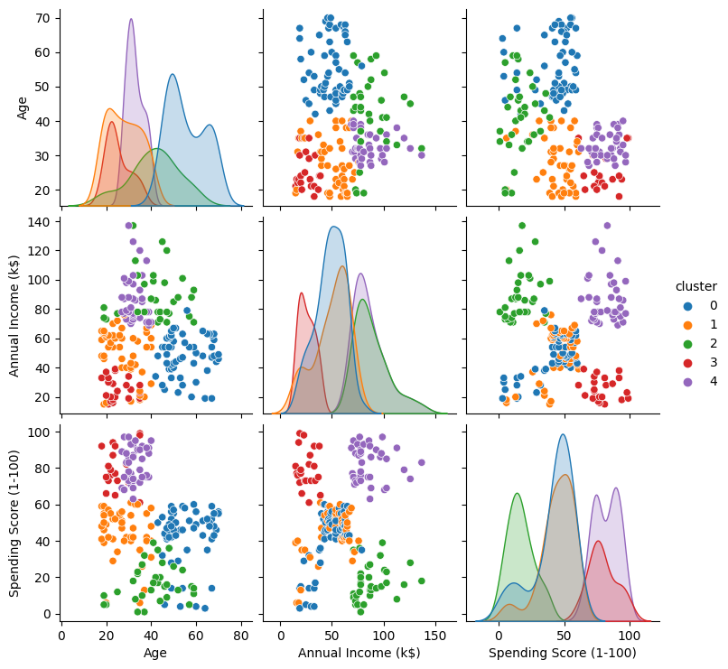

[](https://www.linkedin.com/in/braulio-campos-/)
[](https://www.python.org/)

# Customer Segmentation work using Python

<p align="center"> 
  <a href="https://www.linkedin.com/in/braulio-campos-/" target="_blank"></a> 
</p>

A supermarket, through loyalty cards, has some basic data about its customers, such as age, gender, annual income and spending score. Such a score is something that the supermarket assigns to the customer based on defined parameters, such as customer behavior and purchase data.

The aim of this project is to segment customers based on their purchasing data so that the supermarket can understand customers better and formulate business strategies accordingly.


> database: Mall_Customers.csv

[Kaggle]( https://www.kaggle.com/code/joshuaswords/data-visualization-clustering-mall-data/notebook)

## Goals

The goal of this project is to show students how to segment customers based on their purchasing data. In a real scenario, such segmentation could be used by the supermarket to understand customers better and formulate business strategies accordingly.

During the course, I showed the importance of pre-processing the data, as well as the importance of carrying out exploratory data analysis. Furthermore, I showed how to use the K-Means algorithm to segment customers.

### Repository Structure

```
|- dados
|- imagens
|- modelos
|- notebooks
|- reports

```

## Details of the dataset used and summary of results

The dataset used is the one contained in the file [`Mall_Customers.csv`](dados/Mall_Customers.csv), which contains the following data:

- `CustomerID`: Customer ID
- `Gender`: customer’s gender
- `Age`: customer age
- `Annual Income (k$)`: customer’s annual income
- `Spending Score (1-100)`: customer spending score

With the pipeline performing pre-processing, PCA and K-Means, the base was segmented into 5 clusters, as shown in the figures below:

#### Pairplot


#### Boxplot


- Cluster 0 - moderate spending score, moderate income, high age
- Cluster 1 - moderate spending score, moderate income, young age
- Cluster 2 - low spending score, high income, moderate age
- Cluster 3 - high spending score, low income, young age
- Cluster 4 - high spending score, high income, young age

Transforming the points above into a table:

| Spending Score | Income | Age | Cluster |
| ------------------- | -------- | -------- | ------- |
| Moderate | Moderate | High | 0 |
| Moderate | Moderate | Young | 1 |
| Low | High | Moderate | 2 |
| High | Low | Young | 3 |
| High | High | Young | 4 |

### Requirements 
[Requirements](requirements.txt)